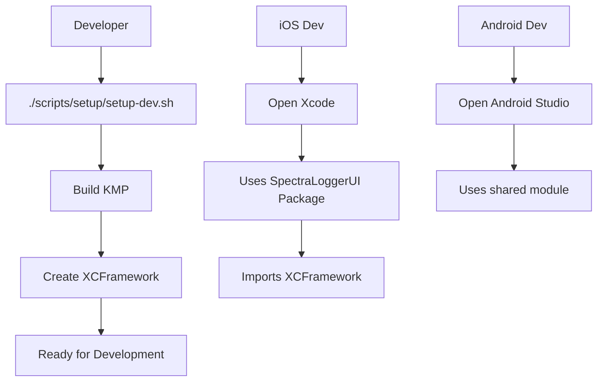
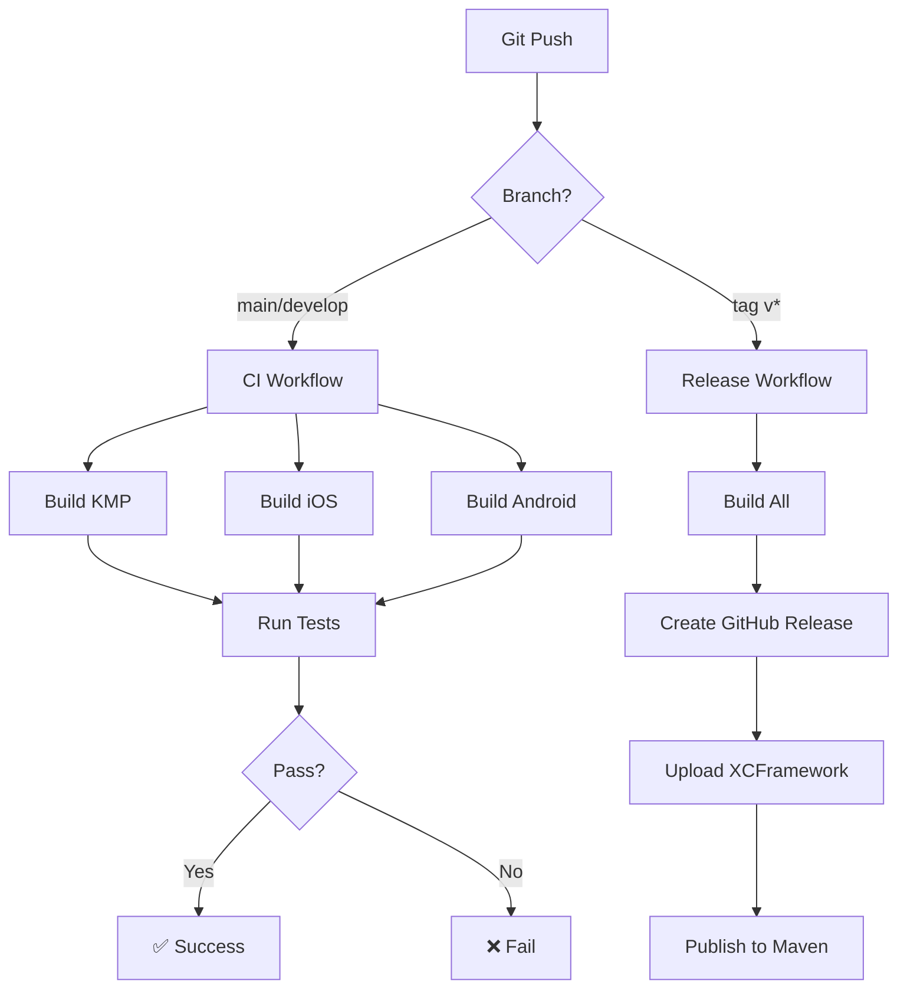

# Spectra Logger Architecture

> **Last Updated**: 2025-10-07

## Overview

Spectra Logger is a cross-platform logging framework built with Kotlin Multiplatform, featuring native UI experiences for iOS and Android.

## Architecture Layers

```
┌─────────────────────────────────────────────┐
│            User Applications                │
│         (iOS Apps / Android Apps)           │
└────────────┬────────────────────────────────┘
             │
             ├─────────────────┬──────────────┐
             │                 │              │
┌────────────▼──────┐  ┌──────▼─────┐  ┌────▼────────┐
│  SpectraLoggerUI  │  │ Android UI │  │   Core API  │
│  (Swift Package)  │  │  (Compose) │  │   (KMP)     │
│                   │  │            │  │             │
│  - SwiftUI Views  │  │ - Compose  │  │ - Logging   │
│  - ViewModels     │  │ - Material │  │ - Storage   │
│  - iOS Native     │  │   Design   │  │ - Models    │
└────────────┬──────┘  └──────┬─────┘  └────┬────────┘
             │                 │              │
             └─────────────────┴──────────────┘
                            │
             ┌──────────────▼──────────────┐
             │   SpectraLogger.xcframework │
             │   (Kotlin Multiplatform)    │
             │                             │
             │   - Business Logic          │
             │   - Data Layer              │
             │   - Platform Abstractions   │
             └─────────────────────────────┘
```

## Project Structure

### Monorepo Layout

```
Spectra/  (Monorepo)
│
├── shared/                          ← KMP Core (Kotlin)
│   ├── src/
│   │   ├── commonMain/             ← Shared business logic
│   │   ├── androidMain/            ← Android-specific
│   │   └── iosMain/                ← iOS-specific
│   ├── build.gradle.kts
│   └── build/
│       └── XCFrameworks/           ← Compiled iOS frameworks
│           └── release/
│               └── SpectraLogger.xcframework
│
├── SpectraLoggerUI/                 ← iOS UI (Swift Package)
│   ├── Package.swift
│   ├── Sources/
│   │   └── SpectraLoggerUI/
│   │       ├── SpectraLoggerView.swift  ← Public API
│   │       ├── Views/              ← SwiftUI screens
│   │       │   ├── LogsView.swift
│   │       │   ├── NetworkLogsView.swift
│   │       │   └── SettingsView.swift
│   │       └── ViewModels/         ← Swift ViewModels
│   │           ├── LogsViewModel.swift
│   │           ├── NetworkLogsViewModel.swift
│   │           └── SettingsViewModel.swift
│   └── README.md
│
├── examples/
│   ├── ios-native/                 ← iOS example app
│   │   └── SpectraExample.xcodeproj
│   └── android/                    ← Android example app
│       └── build.gradle.kts
│
├── scripts/                         ← Build & CI/CD scripts
│   ├── build/                      ← Build scripts
│   │   ├── build-kmp.sh
│   │   ├── build-ios-xcframework.sh
│   │   ├── build-ios-example.sh
│   │   ├── build-android-example.sh
│   │   └── build-all.sh
│   ├── test/                       ← Test scripts
│   │   ├── test-kmp.sh
│   │   ├── test-ios.sh
│   │   ├── test-android.sh
│   │   └── test-all.sh
│   ├── setup/                      ← Setup scripts
│   │   ├── setup-dev.sh
│   │   └── clean-all.sh
│   ├── ci/                         ← CI utilities
│   │   └── pre-commit.sh
│   └── SCRIPTS_README.md
│
├── .github/
│   └── workflows/                  ← GitHub Actions
│       ├── ci.yml                  ← Main CI pipeline
│       ├── release.yml             ← Release automation
│       └── pr-check.yml            ← PR quality checks
│
├── docs/                           ← Documentation
├── gradle/                         ← Gradle wrapper
├── build.gradle.kts                ← Root build file
├── settings.gradle.kts
├── ARCHITECTURE.md                 ← This file
└── README.md
```

## Technology Stack

### Core (KMP)
- **Language**: Kotlin 1.9+
- **Platforms**: Android, iOS
- **Frameworks**:
  - Kotlin Coroutines
  - Kotlin Serialization
  - Compose Multiplatform (for Android UI)

### iOS
- **UI Framework**: SwiftUI
- **Language**: Swift 5.9+
- **Minimum iOS**: 15.0
- **Distribution**: Swift Package Manager

### Android
- **UI Framework**: Jetpack Compose
- **Minimum SDK**: 24 (Android 7.0)
- **Distribution**: Maven Central / JitPack

## Key Design Decisions

### 1. Two-Layer SDK Architecture

**Decision**: Split into core (KMP) and UI (platform-specific) layers

**Rationale**:
- ✅ Native look & feel per platform
- ✅ Users can use core without UI
- ✅ Easier to maintain platform-specific designs
- ✅ Industry standard (Firebase, Stripe, Amplify pattern)

**Trade-offs**:
- More complexity than single-layer
- UI code not shared (intentional for native experience)

### 2. Monorepo vs Multi-Repo

**Decision**: Monorepo

**Rationale**:
- ✅ Single source of truth
- ✅ Atomic commits across layers
- ✅ Simpler CI/CD
- ✅ Easier for contributors

**Examples**: Firebase, Stripe, Sentry all use monorepos

### 3. Swift Package for iOS UI

**Decision**: Swift Package Manager (not CocoaPods/Carthage)

**Rationale**:
- ✅ Apple's recommended approach
- ✅ Modern, built into Xcode
- ✅ Source-based distribution
- ✅ Better for monorepos

### 4. XCFramework for KMP

**Decision**: Binary XCFramework (not source)

**Rationale**:
- ✅ Compiles once, reuse everywhere
- ✅ Faster builds for consumers
- ✅ Hides Kotlin implementation details
- ✅ Standard iOS distribution format

## Data Flow

### iOS

```
┌──────────────────┐
│   User Action    │
│   (SwiftUI)      │
└────────┬─────────┘
         │
┌────────▼─────────┐
│  LogsViewModel   │  ← Swift
│  (ObservableObj) │
└────────┬─────────┘
         │
┌────────▼─────────┐
│  LogStorage      │  ← KMP (from XCFramework)
│  (Kotlin)        │
└────────┬─────────┘
         │
┌────────▼─────────┐
│  InMemoryBuffer  │  ← KMP
│  (Circular)      │
└──────────────────┘
```

### Android

```
┌──────────────────┐
│   User Action    │
│   (Compose)      │
└────────┬─────────┘
         │
┌────────▼─────────┐
│  ViewModel       │  ← Android
│  (StateFlow)     │
└────────┬─────────┘
         │
┌────────▼─────────┐
│  LogStorage      │  ← KMP
│  (Kotlin)        │
└────────┬─────────┘
         │
┌────────▼─────────┐
│  InMemoryBuffer  │  ← KMP
│  (Circular)      │
└──────────────────┘
```

## Build Process

### Development Build



### CI/CD Pipeline



## Distribution

### iOS

**Swift Package Manager** (Recommended)

```swift
// Add to Package.swift or Xcode
dependencies: [
    .package(url: "https://github.com/yourname/Spectra", from: "1.0.0")
]
```

**CocoaPods** (Coming Soon)

```ruby
pod 'SpectraLoggerUI', '~> 1.0'
```

### Android

**Gradle** (Maven Central)

```kotlin
dependencies {
    implementation("com.spectra.logger:spectra-logger:1.0.0")
}
```

## Performance Characteristics

| Operation | Target | Critical Threshold |
|-----------|--------|-------------------|
| Log Capture | < 0.1ms | < 1ms |
| Network Intercept | < 5ms | < 20ms |
| UI Scroll (60 FPS) | 16ms/frame | 33ms/frame |
| Memory (10K logs) | < 50MB | < 100MB |

## Security Considerations

- No sensitive data logging by default
- Optional encryption for persistent storage
- Network logs exclude sensitive headers (Authorization, etc.)
- Compliance with GDPR/CCPA for data retention

## Future Enhancements

- [ ] Web platform support (Kotlin/JS)
- [ ] Desktop support (JVM)
- [ ] Remote logging backend
- [ ] Log encryption
- [ ] Analytics integration
- [ ] Crash reporting integration

## References

- [Kotlin Multiplatform](https://kotlinlang.org/docs/multiplatform.html)
- [Compose Multiplatform](https://www.jetbrains.com/lp/compose-multiplatform/)
- [Swift Package Manager](https://swift.org/package-manager/)
- [Firebase Architecture](https://firebase.google.com/docs/ios/setup)

---

**Document Version**: 1.0
**Last Updated**: 2025-10-07
**Maintainer**: Spectra Team
