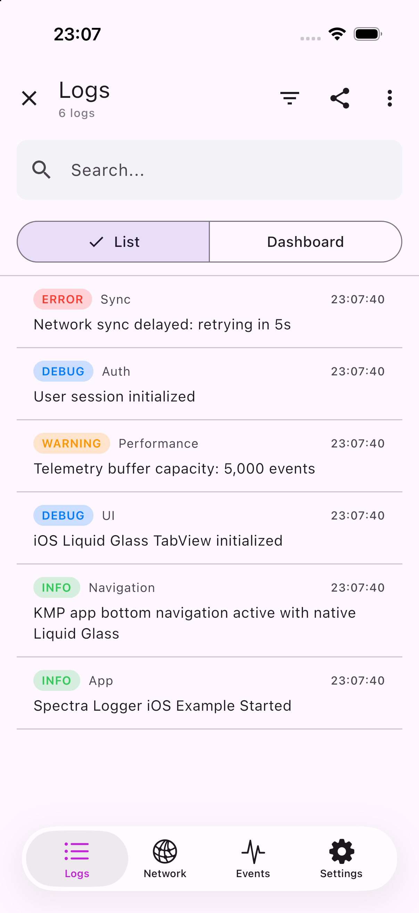
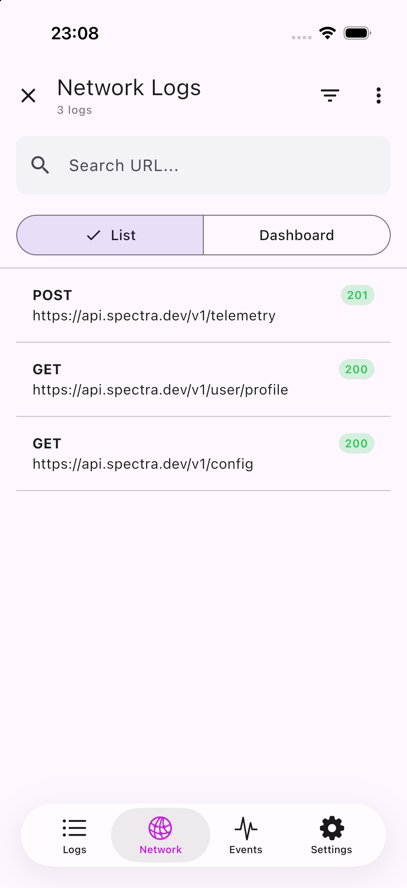
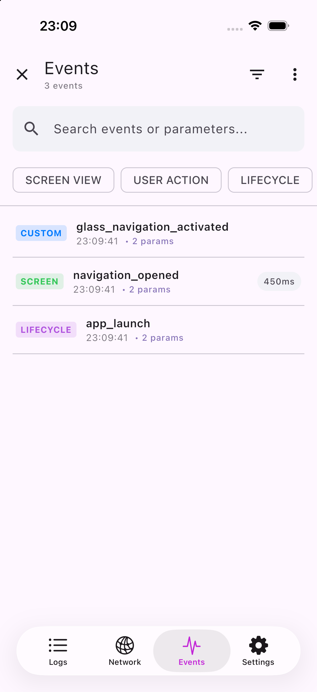
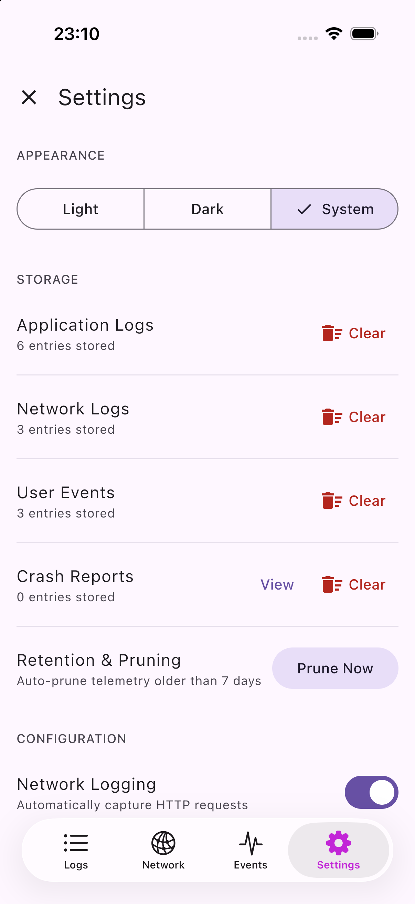
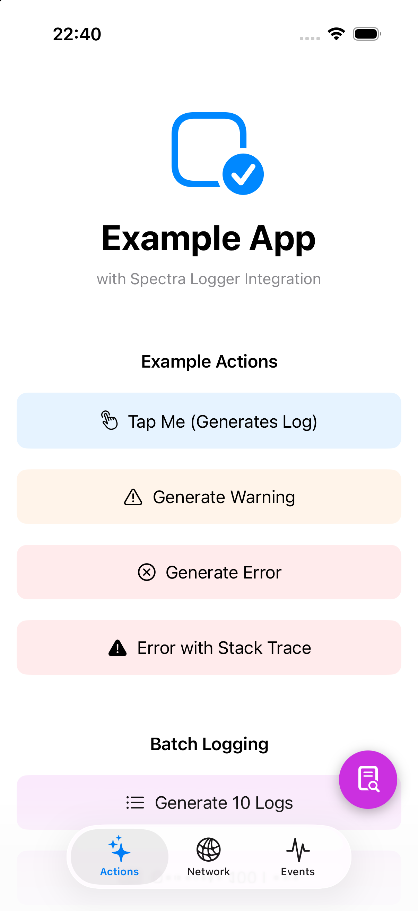
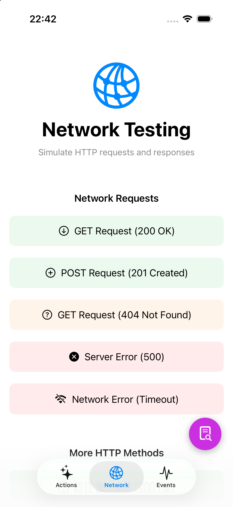
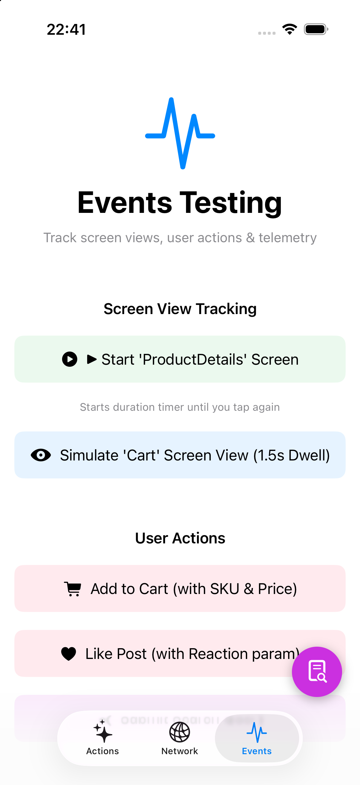

<div align="center">

# Spectra

**The High-Performance, On-Device Debugging, Logging & Telemetry Ecosystem**  
*Unified by Kotlin Multiplatform & Compose Multiplatform for Android, iOS, Web & Desktop*

[](https://github.com/snooky23/spectra/releases)
[]()
[](https://github.com/snooky23/spectra/actions/workflows/ci.yml)
[](https://kotlinlang.org)
[](https://swift.org)
[](https://www.jetbrains.com/lp/compose-multiplatform/)
[](LICENSE)

<br/>

[📸 Screenshots](#visual-showcase) •
[✨ Key Features](#key-features) •
[⚙️ Settings](#settings-management) •
[📦 Installation](#installation) •
[🧩 Compose Multiplatform](#cmp-guide) •
[🤖 Android](#android-guide) •
[🍎 iOS](#ios-guide) •
[🌐 Web](#web-guide) •
[💻 Desktop](#desktop-guide) •
[📚 Documentation](#documentation)

<br/>

</div>

---

## 💡 Overview

**Spectra** is a developer-first, on-device diagnostic and telemetry suite. Built from the ground up on modern **Kotlin Multiplatform (KMP)** and **Compose Multiplatform (CMP)**, it gives mobile and multiplatform engineering teams a single unified developer tool:

- **Zero-Latency In-App Inspector**: Examine live log streams, inspect full HTTP/HTTPS network traffic (headers, bodies, latency), and analyze analytics events and screen dwell times directly inside your running app.
- **Adaptive Native Experience**: Automatically renders **Liquid Glass floating navigation on iOS 26+** and **Material 3 Adaptive split-pane layouts on Android tablets, foldables, and desktop**.
- **Cross-Platform Parity**: 100% shared data models, circular non-blocking memory buffers, and synchronized APIs across Kotlin and Swift.
- **Single Umbrella Dependency**: Import everything with one package (`Spectra`) or pick and choose individual Core or UI modules.

---

<a id="visual-showcase"></a>
## 📸 Visual Showcase

### In-App Debug Inspector *(Compose Multiplatform & Liquid Glass UI)*

<table>
  <tr>
    <td width="50%" align="center">
      <h3>Logs Inspector</h3>
      
      <p><b>Real-time Log Stream</b><br/>• Instant search & regex filtering<br/>• Color-coded badges (<code>DEBUG</code>, <code>INFO</code>, <code>WARN</code>, <code>ERROR</code>)<br/>• List / Dashboard aggregation toggle</p>
    </td>
    <td width="50%" align="center">
      <h3>Network Inspector</h3>
      
      <p><b>Live HTTP/HTTPS Traffic</b><br/>• Status code chips (<code>200 OK</code>, <code>201</code>, <code>404</code>, <code>500</code>)<br/>• Headers, JSON payload & latency timing<br/>• Instant URL query filtering</p>
    </td>
  </tr>
  <tr>
    <td width="50%" align="center">
      <h3>Events & Telemetry</h3>
      
      <p><b>User Analytics & Dwell Time</b><br/>• Screen dwell duration tracking (<code>450ms</code>)<br/>• Type filter chips (<code>SCREEN</code>, <code>ACTION</code>, <code>LIFECYCLE</code>)<br/>• Key-value parameter inspector</p>
    </td>
    <td width="50%" align="center">
      <h3>Settings & Storage</h3>
      
      <p><b>Diagnostics & Capacity Management</b><br/>• Dynamic theme switching (Light, Dark, System)<br/>• Storage quota monitoring & category-level purging<br/>• Retention auto-pruning & WebSocket streaming</p>
    </td>
  </tr>
</table>

### Native Example & Playground Application

<table>
  <tr>
    <td width="33.3%" align="center">
      <h4>Generator Actions</h4>
      
      <p>Single & burst log generation, configurable log levels & metadata, and draggable floating debug bubble (FAB).</p>
    </td>
    <td width="33.3%" align="center">
      <h4>Traffic Simulation</h4>
      
      <p>Simulate <code>200 OK</code>, <code>201 Created</code>, error test cases (<code>404</code>, <code>500</code>), timeouts, and bulk network bursts.</p>
    </td>
    <td width="33.3%" align="center">
      <h4>Event Tracking & Dwell</h4>
      
      <p>Automated screen enter/exit dwell timers, button interactions, custom event tracking, and parameter verification.</p>
    </td>
  </tr>
</table>

---

<a id="key-features"></a>
## ✨ Key Features

<table>
<tr>
<td width="50%">

### ⚡ Core Engine & Performance
- **Non-blocking Ring Buffers**: Uses thread-safe circular memory buffers with automatic disk persistence powered by Okio.
- **Zero UI Stutter**: Asynchronous dispatching via Kotlin Coroutines ensures logging never blocks your main thread or UI rendering.
- **Structured Metadata**: Attach arbitrary key-value pairs, nested dictionaries, and throwable stack traces to any entry.
- **Crash & Breadcrumb Recording**: Automatic breadcrumb tracking leading up to handled and unhandled crashes.

</td>
<td width="50%">

### 🌐 Deep Network Interception
- **Native iOS Interception**: Plugs directly into `URLSession` and Alamofire using `SpectraURLProtocol`.
- **Android / JVM OkHttp**: Single-line interceptor with `SpectraOkHttpInterceptor`.
- **Cross-Platform Ktor**: First-class `SpectraKtorPlugin` for Ktor clients on Android, iOS, Desktop, and Web.
- **Payload Inspection**: Safely logs request/response headers, status codes, elapsed durations, and JSON bodies.

</td>
</tr>
<tr>
<td width="50%">

### 🎨 Next-Gen Adaptive UI
- **iOS 26 Liquid Glass**: Native floating translucent pill tab bar with dynamic selection blurs on modern iOS.
- **Material 3 Adaptive**: Automatically switches between compact bottom bar, side navigation rail, and side-by-side list-detail panes on tablets and foldables.
- **ProMotion Ready**: Built for 120Hz smooth scrolling on iOS and Android.

</td>
<td width="50%">

### 📡 Sharing & Streaming
- **One-Click JSONL Export**: Package logs, network traffic, and events into a single compressed `.jsonl` file.
- **Native Share Sheets**: Direct export to Slack, AirDrop, email, or local files via `UIActivityViewController` (iOS) and Android Share Intents.
- **WebSocket Live Streaming**: Stream telemetry in real-time to remote monitoring dashboards via `KtorStreamTransport`.

</td>
</tr>
</table>

---

<a id="architecture"></a>
## 🏛️ Architecture

Spectra follows **Clean Architecture** to maintain complete isolation between data collection, storage, and presentation:

```
┌────────────────────────────────────────────────────────────────────────┐
│                   Host Application Layer                               │
│       Android (Compose / Views)  │  iOS (SwiftUI / UIKit)  │  Web      │
└────────────────────────────────────┬───────────────────────────────────┘
                                     │
                 ┌───────────────────┴───────────────────┐
                 ▼                                       ▼
    ┌─────────────────────────┐             ┌─────────────────────────┐
    │       Spectra UI        │             │      Spectra Core       │
    │  (Compose Multiplatform)│             │     (KMP Business)      │
    │                         │             │                         │
    │ • Material 3 Adaptive   │             │ • Ring Storage Buffers  │
    │ • iOS Liquid Glass Bar  │────────────>│ • OkHttp Interceptor    │
    │ • List-Detail Split     │             │ • iOS URLProtocol       │
    │ • SwiftUI / UIKit Bridge│             │ • Ktor Multiplatform    │
    └─────────────────────────┘             └─────────────────────────┘
                 │                                       │
                 └───────────────────┬───────────────────┘
                                     ▼
        ┌─────────────────────────────────────────────────────────┐
        │                 Unified Umbrella Target                 │
        │    Android: com.spectra:spectra-umbrella                │
        │    iOS: Spectra.xcframework / SPM package: Spectra      │
        └─────────────────────────────────────────────────────────┘
```

<a id="settings-management"></a>
## ⚙️ In-App Settings & Diagnostics

The 4th tab of the Spectra Debug Inspector provides developers and QA engineers with deep, runtime control over their local environment without needing to rebuild or relaunch the application:

<table>
<tr>
<td width="50%">

### 🌓 Appearance & Theming
- **Dynamic Theme Modes**: Toggle seamlessly between **Light**, **Dark**, and **System** modes.
- **Translucent Fluid Blurs**: Automatically applies iOS 26 Liquid Glass floating bars on Apple devices and Material 3 Dynamic Color on Android 12+.
- **Instant Persistence**: Theme preferences persist across app sessions.

</td>
<td width="50%">

### 📊 Storage Quotas & Capacity
- **Live Counter Telemetry**: View real-time stored counts for Application Logs, Network Requests, User Events, and Crash Reports.
- **Granular Purging**: Dedicated **Clear** actions per domain allow clearing noisy network history without losing critical application logs.
- **Automated Retention**: Configurable auto-pruning (e.g. prune telemetry older than 7 days) and manual one-tap **Prune Now** optimization.

</td>
</tr>
<tr>
<td width="50%">

### 💥 Crash Reports & Breadcrumb Trails
- **Crash History Viewer**: Review uncaught exceptions and fatal application states.
- **Timeline Breadcrumbs**: Inspect the sequence of user taps, screen transitions, and log entries immediately preceding the failure.

</td>
<td width="50%">

### 📡 Remote Telemetry Streaming
- **WebSocket Synchronization**: Connect the local client to a remote logging server or team observability dashboard via `wss://`.
- **Live Session Pairing**: Real-time log broadcasting for remote team debugging sessions.

</td>
</tr>
</table>

---

<a id="installation"></a>
## 📦 Installation

Choose the integration method that best matches your project setup:

### Recommended: Unified Umbrella Package
Import both Core logic and the In-App Inspector UI with a single dependency:

#### Compose Multiplatform / KMP Shared (`build.gradle.kts`)
```kotlin
kotlin {
    sourceSets {
        commonMain.dependencies {
            implementation("com.spectra.logger:spectra-umbrella:1.0.5")
        }
    }
}
```

#### Android (`build.gradle.kts`)
```kotlin
dependencies {
    implementation("com.spectra.logger:spectra-umbrella:1.0.5")
}
```

#### iOS (Swift Package Manager)
1. In Xcode: **File → Add Package Dependencies...**
2. Enter Repository URL: `https://github.com/snooky23/spectra`
3. Select Dependency Rule: **Up to Next Major Version** (`1.0.5`)
4. Check the **Spectra** product.

---

### Modular Setup (Advanced)
If you only need headless logging or want to conditionally include the UI in Debug builds:

| Module | Gradle Dependency (KMP / Android) | iOS SPM Product | Purpose |
| :--- | :--- | :--- | :--- |
| **Core Engine** | `com.spectra.logger:spectra-core:1.0.5` | `SpectraLogger` | Headless logging, storage, interceptors |
| **Unified UI** | `com.spectra.logger:spectra-ui:1.0.5` | `SpectraLoggerUI` | Compose Multiplatform inspector viewer |
| **Umbrella** | `com.spectra.logger:spectra-umbrella:1.0.5` | `Spectra` | **Recommended:** Core + UI combined |

---

<a id="cmp-guide"></a>
## 🧩 Compose Multiplatform (CMP Shared) Guide

If your project is built with **Compose Multiplatform (CMP)** targeting Android, iOS, Desktop, or Web, you can implement **100% of your logging, network interception, and debug UI in `commonMain`** without writing platform-specific wrappers.

### 1. Add Dependency in `commonMain`
```kotlin
// build.gradle.kts
kotlin {
    sourceSets {
        commonMain.dependencies {
            // Spectra Umbrella provides both Core logging and the Compose Inspector UI
            implementation("com.spectra.logger:spectra-umbrella:1.0.5")
        }
    }
}
```

### 2. Configure & Log in Shared Code
Initialize Spectra once during your app's startup sequence in `commonMain`:

```kotlin
import com.spectra.logger.SpectraLogger
import com.spectra.logger.feature.logs.model.LogLevel
import com.spectra.logger.feature.events.model.EventType

// Global logger configuration
SpectraLogger.configure {
    minLogLevel = LogLevel.VERBOSE
    logStorage { maxCapacity = 5_000 }
    eventStorage { maxCapacity = 2_000 }
}

// Log from any shared ViewModel, Repository, or UseCase
SpectraLogger.d("Repository", "Fetching remote product feed")
SpectraLogger.i("Analytics", "User opened detail view", metadata = mapOf("item_id" to "prod_42"))

// Screen dwell time & analytics tracking
SpectraLogger.event(
    name = "screen_dwell",
    parameters = mapOf("screen" to "FeedScreen"),
    eventType = EventType.screenView,
    durationMs = 3_200L
)
```

### 3. Cross-Platform Ktor HTTP Interceptor
Install `SpectraKtorPlugin` into your shared `HttpClient` to automatically capture all HTTP requests, responses, status codes, and JSON bodies across Android, iOS, Desktop, and Web:

```kotlin
import com.spectra.logger.feature.network.interceptor.SpectraKtorPlugin
import io.ktor.client.HttpClient

val sharedHttpClient = HttpClient {
    install(SpectraKtorPlugin) {
        maxBodySize = 250_000L
        ignoreHosts("telemetry.internal.net")
    }
}
```

### 4. Present the In-App Inspector in Shared Compose
Because `SpectraLoggerScreen` is a pure `@Composable`, you can integrate it directly into your shared UI tree:

#### Pattern A: Shared Navigation Destination (Navigation Compose / Voyager / Decompose)
```kotlin
import androidx.navigation.compose.NavHost
import androidx.navigation.compose.composable
import androidx.navigation.compose.rememberNavController
import com.spectra.logger.core.ui.compose.SpectraLoggerScreen

@Composable
fun SharedApp() {
    val navController = rememberNavController()

    NavHost(navController = navController, startDestination = "home") {
        composable("home") {
            HomeScreen(onOpenDebugger = { navController.navigate("spectra_debug") })
        }
        composable("spectra_debug") {
            // Fullscreen adaptive inspector destination
            SpectraLoggerScreen(onDismiss = { navController.popBackStack() })
        }
    }
}
```

#### Pattern B: Shared Modal Bottom Sheet
```kotlin
import androidx.compose.foundation.layout.Box
import androidx.compose.foundation.layout.fillMaxSize
import androidx.compose.material3.ExperimentalMaterial3Api
import androidx.compose.material3.ModalBottomSheet
import androidx.compose.runtime.*
import androidx.compose.ui.Modifier
import com.spectra.logger.core.ui.compose.SpectraLoggerScreen

@OptIn(ExperimentalMaterial3Api::class)
@Composable
fun SharedAppRoot() {
    var isDebugSheetOpen by remember { mutableStateOf(false) }

    Box(modifier = Modifier.fillMaxSize()) {
        MainAppContent(onOpenDebug = { isDebugSheetOpen = true })

        if (isDebugSheetOpen) {
            ModalBottomSheet(onDismissRequest = { isDebugSheetOpen = false }) {
                SpectraLoggerScreen(onDismiss = { isDebugSheetOpen = false })
            }
        }
    }
}
```

#### Pattern C: Universal Trigger with `SpectraUI.showScreen()`
From any button or gesture in your shared Compose UI, call `SpectraUI.showScreen()` to trigger the modal debugger:

```kotlin
import com.spectra.logger.core.ui.SpectraUI

Button(onClick = { SpectraUI.showScreen() }) {
    Text("Open Debugger")
}
```

---

<a id="android-guide"></a>
## 🤖 Android Guide

### 1. Initialize Spectra
Configure Spectra in your `Application` class or main activity:

```kotlin
import com.spectra.logger.SpectraLogger
import com.spectra.logger.feature.logs.model.LogLevel

class MyApplication : Application() {
    override fun onCreate() {
        super.onCreate()
        
        SpectraLogger.configure {
            minLogLevel = if (BuildConfig.DEBUG) LogLevel.VERBOSE else LogLevel.INFO
            logStorage {
                maxCapacity = 5_000
            }
            eventStorage {
                maxCapacity = 2_000
            }
        }
    }
}
```

### 2. Log Messages & Track Events
```kotlin
// Basic logging across all severity levels
SpectraLogger.v("UI", "User scrolled to item 42")
SpectraLogger.d("Database", "Loaded 15 items in 4ms")
SpectraLogger.i("Auth", "User logged in successfully")
SpectraLogger.w("Cache", "Cache near maximum capacity (89%)")
SpectraLogger.e("Network", "Failed to fetch user profile", exception)
SpectraLogger.f("Fatal", "Database corrupted, rebuilding...")

// Structured metadata
SpectraLogger.i(
    tag = "Checkout",
    message = "Payment completed",
    metadata = mapOf("order_id" to "ord_9182", "amount" to "$49.99", "currency" to "USD")
)

// Analytics & Screen Dwell Tracking
SpectraLogger.event(
    name = "screen_view",
    parameters = mapOf("screen" to "ProfileScreen"),
    eventType = EventType.screenView,
    durationMs = 3_450L // 3.45s spent on screen
)
```

### 3. Network Interception (OkHttp & Ktor)

#### OkHttp:
```kotlin
import com.spectra.logger.feature.network.interceptor.SpectraOkHttpInterceptor

val okHttpClient = OkHttpClient.Builder()
    .addInterceptor(SpectraOkHttpInterceptor(maxBodySize = 250_000L))
    .build()
```

#### Ktor HTTP Client:
```kotlin
import com.spectra.logger.feature.network.interceptor.SpectraKtorPlugin

val client = HttpClient(OkHttp) {
    install(SpectraKtorPlugin) {
        maxBodySize = 250_000L
        ignoreHosts("analytics.internal.net")
    }
}
```

### 4. In-App Debug Inspector UI

#### Floating Debug Bubble (FAB):
Wrap your Jetpack Compose root to get a draggable floating debug bubble in Debug builds:

```kotlin
import com.spectra.logger.core.ui.compose.SpectraLoggerFabOverlay
import com.spectra.logger.core.ui.SpectraUI

@Composable
fun AppRoot() {
    SpectraLoggerFabOverlay(enabled = BuildConfig.DEBUG) {
        MainAppContent()
    }
}
```

#### Open Programmatically:
```kotlin
Button(onClick = { SpectraUI.showScreen() }) {
    Text("Open Spectra Logger")
}
```

---

<a id="ios-guide"></a>
## 🍎 iOS Guide

### 1. Configure ProMotion & High Refresh Rate
Compose Multiplatform requires consistent frame pacing. Add the following key to your iOS app's `Info.plist`:

```xml
<key>CADisableMinimumFrameDurationOnPhone</key>
<true/>
```

### 2. Initialize in SwiftUI App
```swift
import SwiftUI
import Spectra

@main
struct MyApp: App {
    init() {
        SpectraLogger.shared.configure { config in
            config.minLogLevel = .debug
        }
    }

    var body: some Scene {
        WindowGroup {
            ContentView()
        }
    }
}
```

### 3. Log Messages & Track Events
```swift
import Spectra

// Logging with metadata
SpectraLogger.shared.d(
    tag: "Network",
    message: "Request queued",
    throwable: nil,
    metadata: ["retry_count": "0"]
)

// Record errors with call stack
do {
    try authenticate()
} catch {
    SpectraLogger.shared.e(
        tag: "Auth",
        message: "Login failed",
        throwable: KotlinThrowable(message: error.localizedDescription),
        metadata: [:]
    )
}

// Analytics and screen dwell tracking
SpectraLogger.shared.event(
    name: "checkout_completed",
    parameters: ["cart_items": "3", "tier": "gold"],
    eventType: EventType.userAction,
    durationMs: nil
)
```

### 4. Automatic Network Interception (URLSession & Alamofire)
Register `SpectraURLProtocol` in your `URLSessionConfiguration`:

```swift
import Spectra

// Standard URLSession
let config = URLSessionConfiguration.default
config.protocolClasses = [SpectraURLProtocol.self] + (config.protocolClasses ?? [])
let session = URLSession(configuration: config)

// Global URLProtocol registration (catches shared requests)
URLProtocol.registerClass(SpectraURLProtocol.self)
```

### 5. Present the In-App Inspector (SwiftUI)
Present `SpectraLoggerView` in a sheet. It automatically uses the native **iOS 26 Liquid Glass navigation bar**:

```swift
import SwiftUI
import Spectra

struct ContentView: View {
    @State private var isSpectraOpen = false

    var body: some View {
        Button("Open Debug Inspector") {
            isSpectraOpen = true
        }
        .fullScreenCover(isPresented: $isSpectraOpen) {
            SpectraLoggerView(onDismiss: {
                isSpectraOpen = false
            })
        }
    }
}
```

### 6. Deep Link Support
Launch Spectra from anywhere (such as Safari, notifications, or terminal) via custom URL scheme:

```bash
# Open directly in iOS Simulator
xcrun simctl openurl booted "spectralogger://logs"
```

---

<a id="web-guide"></a>
## 🌐 Web Guide *(Wasm & JS)*

Spectra provides first-class support for **Kotlin/Wasm (`wasmJs`)** and **Kotlin/JS (`js`)** in browser and Node.js environments:

### 1. Gradle Dependency
```kotlin
// commonMain or wasmJsMain / jsMain in build.gradle.kts
dependencies {
    implementation("com.spectra.logger:spectra-core:1.0.5")
}
```

### 2. Browser Usage
On Web targets, Spectra automatically uses an optimized **in-memory circular buffer** that does not depend on local disk storage:

```kotlin
import com.spectra.logger.SpectraLogger
import com.spectra.logger.feature.network.interceptor.SpectraKtorPlugin
import io.ktor.client.*
import io.ktor.client.engine.js.*

// Standard logging in web applications
SpectraLogger.i("WebClient", "SPA initialized")

// Intercept browser fetch / XHR requests with Ktor
val httpClient = HttpClient(Js) {
    install(SpectraKtorPlugin)
}
```

### 3. Remote WebSocket Streaming
Stream browser logs, network requests, and events in real-time to an observability server:

```kotlin
import com.spectra.logger.feature.streaming.transport.KtorStreamTransport

// Real-time synchronization over WebSockets
SpectraLogger.streamClient.connect(
    endpoint = "wss://telemetry.yourdomain.com/v1/stream",
    authToken = "bearer_token"
)
```

---

<a id="desktop-guide"></a>
## 💻 Desktop / JVM Guide

Spectra supports **macOS (Intel & Apple Silicon)**, **Linux**, and **Windows**:

```kotlin
dependencies {
    // Desktop Compose Multiplatform UI
    implementation("com.spectra.logger:spectra-umbrella:1.0.5")
}
```

```kotlin
import androidx.compose.ui.window.Window
import androidx.compose.ui.window.application
import com.spectra.logger.ui.compose.SpectraLoggerScreen

fun main() = application {
    Window(onCloseRequest = ::exitApplication, title = "Spectra Debugger") {
        // Runs standalone on Desktop with full Hot Reload support
        SpectraLoggerScreen()
    }
}
```

---

## 📤 Exporting & Sharing Logs

Export the complete debug history (logs, network requests, analytics events) into a single standard **JSON Lines (`.jsonl`)** file:

### Android
```kotlin
val exportPath = SpectraLogger.exportLogs()

// Share via Android Intent
val file = File(exportPath)
val uri = FileProvider.getUriForFile(context, "${context.packageName}.provider", file)
val shareIntent = Intent(Intent.ACTION_SEND).apply {
    type = "application/x-jsonlines"
    putExtra(Intent.EXTRA_STREAM, uri)
    addFlags(Intent.FLAG_GRANT_READ_URI_PERMISSION)
}
context.startActivity(Intent.createChooser(shareIntent, "Export Spectra Logs"))
```

### iOS
```swift
let exportPath = SpectraLogger.shared.exportLogs()
let url = URL(fileURLWithPath: exportPath)

let activityVC = UIActivityViewController(activityItems: [url], applicationActivities: nil)
if let windowScene = UIApplication.shared.connectedScenes.first as? UIWindowScene,
   let rootVC = windowScene.windows.first?.rootViewController {
    rootVC.present(activityVC, animated: true)
}
```

---

<a id="documentation"></a>
## 📚 Documentation

Detailed guides and specifications are available in the repository:

- 📖 **[Complete API Reference](docs/guides/API.md)** — Exhaustive method signatures and parameter references.
- 🚀 **[Developer Onboarding Guide](docs/guides/DEVELOPER_GUIDE.md)** — Environment setup, toolchains, and build steps.
- ⚙️ **[Configuration Guide](docs/guides/CONFIGURATION.md)** — Storage limits, retention policies, and log levels.
- 📦 **[SPM Distribution & Setup](docs/guides/SPM_DISTRIBUTION_GUIDE.md)** — Binary targets, checksums, and CocoaPods migration.
- 🏛️ **[System Architecture](docs/design/ARCHITECTURE.md)** — Architectural layers, Clean Architecture, and KMP topology.
- 🎨 **[Adaptive UI & Liquid Glass](docs/design/UI_DESIGN.md)** — Design tokens, iOS 26 Liquid Glass navigation, and Material 3 layouts.
- 🔧 **[Troubleshooting & FAQ](docs/guides/TROUBLESHOOTING.md)** — Common setup pitfalls and debugging tips.
- 🔄 **[CI/CD & Pipeline Guide](docs/CI_CD.md)** — GitHub Actions workflows and release process.

---

## 🤝 Contributing

Contributions to Spectra Logger are warmly welcomed! Please read our [Developer Guide](docs/guides/DEVELOPER_GUIDE.md) to get started with building the project locally.

1. Fork the Project
2. Create your Feature Branch (`git checkout -b feature/amazing-feature`)
3. Commit your Changes (`git commit -m 'feat: add amazing feature'`)
4. Push to the Branch (`git push origin feature/amazing-feature`)
5. Open a Pull Request

---

## 📄 License

Spectra Logger is open-source software licensed under the **Apache 2.0 License**. See the [LICENSE](LICENSE) file for details.

<div align="center">
  <sub>Built with ❤️ by Avi Levin and the Spectra Multiplatform contributors.</sub>
</div>
