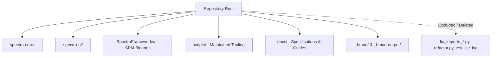

# Architecture Spine & Software Design Document (SDD) — Codebase Cleanup

## Design Paradigm

**Pristine Repository Hygiene**: The repository follows strict structural separation between production source modules (`spectra-core`, `spectra-ui`), officially packaged binary artifacts (`SpectraFrameworks/`), automated tool configurations (`_bmad/`, `config/`), permanent developer tooling (`scripts/`), and documentation (`docs/`). One-off scratch scripts, local debug logs, and IDE caches are strictly forbidden from lingering in the root workspace or Git tracking index.



## Invariants & Rules

### AD-1 [ADOPTED] — Root Directory Sanctity
- **Binds:** `CAP-1`
- **Prevents:** Root-level clutter, accidental execution of outdated transitional scripts, and security/confidentiality leakage.
- **Rule:** The repository root shall only contain standard build manifests (`build.gradle.kts`, `settings.gradle.kts`, `Package.swift`, `gradlew`), distribution descriptors (`SpectraLogger.json`), and primary project documentation (`README.md`, `CHANGELOG.md`, `CLAUDE.md`, `TASKS.md`, `LICENSE`). All one-off scripts (`fix_imports_2.py`, `fix_imports_3.py`, `refactor.py`, `add_build_phase.rb`), temporary test files (`test.kt`), and local build logs (`build-xcframework.log`) must be deleted.

### AD-2 [ADOPTED] — Hierarchical Git Ignore Rules
- **Binds:** `CAP-2`
- **Prevents:** Leaks of IDE state, device streaming metadata, and OS-generated files from nested subprojects (`examples/`).
- **Rule:** Root `.gitignore` must use recursive patterns for IDE caches (e.g. `**/.idea/caches/`, `**/.idea/libraries/`) and local IDE state files. Any existing tracked cache files (specifically `examples/.idea/caches/deviceStreaming.xml`) must be untracked (`git rm --cached`).

### AD-3 [ADOPTED] — IDE Compiler Configuration Coherence
- **Binds:** `CAP-2`, `CAP-3`
- **Prevents:** Kotlin/Java bytecode target warnings and IntelliJ IDEA build synchronization mismatches.
- **Rule:** `.idea/compiler.xml` must only specify bytecode target levels for active Gradle modules. Stale module references (`Spectra.examples.android-native.app`, `Spectra.spectra-core`, `Spectra.spectra-core.jvmMain`, `Spectra.spectra-ui`, `Spectra.spectra-ui-android`) shall be updated or removed to align with current project structure.

### AD-4 [ADOPTED] — Settings & Inclusions Clarity
- **Binds:** `CAP-3`
- **Prevents:** Confusion regarding disabled or experimental example applications.
- **Rule:** In `settings.gradle.kts`, commented-out inclusions (such as `examples:kmp-app:shared`) must be annotated with clear explanatory comments indicating why they are suspended or removed if obsolete.

## Consistency Conventions

| Concern | Convention | Enforced By |
| :--- | :--- | :--- |
| **Scripts Location** | Reusable scripts belong in `scripts/<category>/`; scratch scripts are ephemeral and deleted after execution | Code review & CI |
| **Ignored Files** | Ignored patterns must cover root and all nested subdirectories (`**/...`) | `.gitignore` |
| **SPM Artifacts** | Prebuilt XCFrameworks reside strictly in `SpectraFrameworks/` | `Package.swift` |
| **Documentation** | Architectural and design specs reside in `docs/design/` and `_bmad-output/` | Repository structure |

## Target Repository Structure (Cleaned State)

```text
/
├── .agent/                    # Google Antigravity skills & agents
├── .agents/                   # Gemini CLI skills & agents
├── _bmad/                     # BMAD framework configuration & core
├── _bmad-output/              # Planning & implementation artifacts
├── config/                    # Code quality configs (detekt, dependency-check)
├── docs/                      # Architectural design & user guides
├── examples/                  # Clean sample applications
│   ├── android-native/
│   ├── ios-native/
│   └── kmp-app/
├── gradle/                    # Gradle wrapper
├── scripts/                   # Production build & release scripts
│   ├── build/
│   ├── ci/
│   └── release/
├── spectra-core/              # Core KMP SDK
├── spectra-ui/                # Compose Multiplatform UI SDK
├── SpectraFrameworks/         # Binary XCFramework releases for SPM
├── build.gradle.kts
├── settings.gradle.kts
├── Package.swift
├── SpectraLogger.json
├── README.md
├── CHANGELOG.md
├── CLAUDE.md
└── TASKS.md
```

## Capability → Architecture Map

| Capability | Scope / Affected Files | Governed by |
| :--- | :--- | :--- |
| **CAP-1: Root Cruft Removal** | `fix_imports_*.py`, `refactor.py`, `add_build_phase.rb`, `test.kt`, `*.log` | `AD-1` |
| **CAP-2: Git & IDE Hygiene** | `.gitignore`, `examples/.idea/`, `.idea/compiler.xml` | `AD-2`, `AD-3` |
| **CAP-3: Build Harmonization** | `settings.gradle.kts`, `build.gradle.kts` | `AD-4` |
| **CAP-4: Build Verification** | All Gradle and SPM test targets | `AD-1`, `AD-3`, CI gate |

## Deferred

- **Full KMP Example App Reactivation**: Reactivation and migration of `examples/kmp-app` to Compose Multiplatform 1.10.3 / Material 3 Adaptive is deferred to a dedicated follow-up epic.
