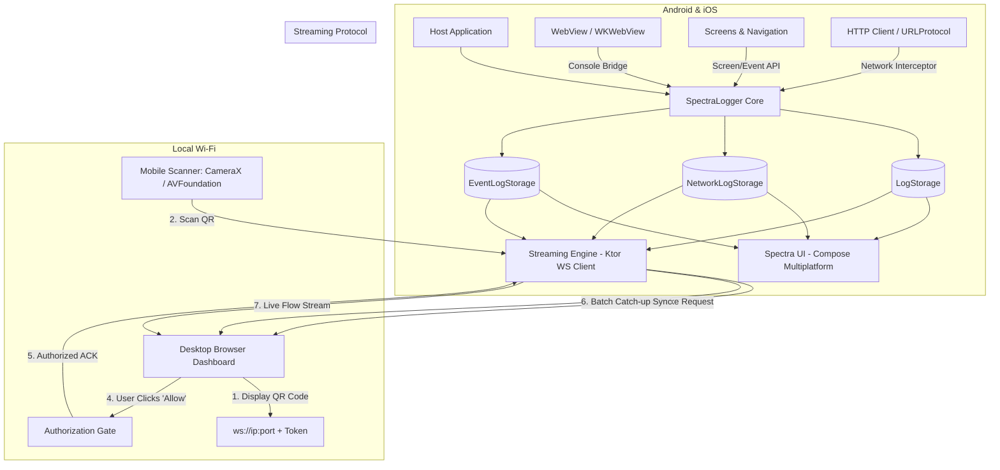

# Architecture Spine & Software Design Document (SDD)

## Design Paradigm

**Universal Telemetry & Live Multiplatform Streaming**: Spectra maintains strict cross-platform symmetry across Android and iOS. Telemetry (Events, WebViews, Network, Logs) is captured by native platform bridges, standardized into Kotlin Multiplatform models in `spectra-core`, rendered locally via Compose Multiplatform in `spectra-ui`, and streamed seamlessly to an authorized desktop browser over local Wi-Fi.



---

## Architectural Decisions & Invariants

### AD-1 [ADOPTED] — Common Core Telemetry Foundation
- **Binds:** `CAP-1`
- **Rule:** `EventLogEntry` is an immutable, `@Serializable` data class in `spectra-core/src/commonMain`. It lives alongside `LogEntry` and `NetworkLogEntry`. All event tracking APIs (`SpectraLogger.event()`, `SpectraLogger.screenStart()`, `SpectraLogger.screenEnd()`) must be thread-safe, non-blocking, and dispatch storage operations to coroutine background scopes.

### AD-2 [ADOPTED] — Zero-Dependency Native WebView Bridges
- **Binds:** `CAP-2`
- **Rule:** WebView integration must not introduce third-party native dependencies. 
  - On Android: Provide `SpectraWebChromeClient` (subclass of `android.webkit.WebChromeClient`) in `androidMain`.
  - On iOS: Provide `SpectraWKScriptMessageHandler` (implementing `WebKit.WKScriptMessageHandler`) in `iosMain` (or Swift companion helper).
  - Both bridges forward to `SpectraLogger.log()` or a dedicated `SpectraLogger.logWebViewMessage()`.

### AD-3 [ADOPTED] — Dual-Phase Streaming with Lazy Bodies
- **Binds:** `CAP-3`
- **Rule:** When the desktop browser authorizes the mobile device:
  1. **Phase 1 (History Catch-up)**: Mobile streams its current in-memory buffer in chunks of 100 entries. Payloads must not block the main/UI thread.
  2. **Phase 2 (Live Streaming)**: Mobile flows emit new log/event/network items as they occur.
  3. **Heavy Payloads**: Large HTTP response bodies over 50KB are transmitted with header metadata first; complete bodies are streamed on-demand when inspected in the browser.

### AD-4 [ADOPTED] — Explicit Browser Gatekeeper Protocol
- **Binds:** `CAP-3`
- **Rule:** No telemetry data leaves the mobile device until the desktop browser receives the handshake packet (`StreamHandshakeRequest`) containing the mobile device info (`model`, `os`, `ip`) and the user manually confirms the connection in the browser UI. The browser returns a cryptographic session confirmation before streaming begins.

### AD-5 [ADOPTED] — Adaptive UI Reuse
- **Binds:** `CAP-1`, `CAP-3`
- **Rule:** The browser dashboard and the in-app `spectra-ui` adhere to the same design system defined in `UI_DESIGN.md`:
  - 40% Master List / 60% Detail Pane split for wide screens.
  - Standardized status tokens (`InfoGreen`, `DebugBlue`, `WarningOrange`, `ErrorRed`).
  - Dark mode and high-contrast accessibility.

---

## Data Models

### 1. `EventLogEntry` (`spectra-core`)
```kotlin
@Serializable
data class EventLogEntry(
    val id: String,
    val timestamp: Instant,
    val eventType: EventType, // SCREEN_VIEW, USER_ACTION, LIFECYCLE, CUSTOM
    val name: String,
    val parameters: Map<String, String> = emptyMap(),
    val durationMs: Long? = null,
    val source: String = "unknown",
    val sourceType: SourceType = SourceType.APP,
)

@Serializable
enum class EventType {
    SCREEN_VIEW,
    USER_ACTION,
    LIFECYCLE,
    CUSTOM
}
```

### 2. Streaming Protocol Packets (`spectra-core`)
```kotlin
@Serializable
sealed class StreamPacket {
    @Serializable
    data class HandshakeRequest(
        val deviceId: String,
        val deviceName: String,
        val os: String,
        val osVersion: String,
        val appVersion: String,
        val token: String
    ) : StreamPacket()

    @Serializable
    data class HandshakeResponse(
        val accepted: Boolean,
        val sessionId: String,
        val reason: String? = null
    ) : StreamPacket()

    @Serializable
    data class BatchHistory(
        val sequence: Int,
        val isFinalBatch: Boolean,
        val logs: List<LogEntry> = emptyList(),
        val networkLogs: List<NetworkLogEntry> = emptyList(),
        val events: List<EventLogEntry> = emptyList()
    ) : StreamPacket()

    @Serializable
    data class LiveLog(val log: LogEntry) : StreamPacket()

    @Serializable
    data class LiveNetwork(val networkLog: NetworkLogEntry) : StreamPacket()

    @Serializable
    data class LiveEvent(val event: EventLogEntry) : StreamPacket()
}
```
