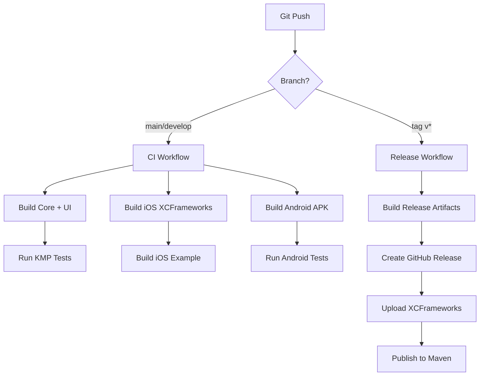

# Spectra Logger Architecture

> **Last Updated**: 2026-04-07

## Overview

Spectra Logger is a cross-platform logging framework built with Kotlin Multiplatform, featuring a unified adaptive UI experience for iOS and Android using Compose Multiplatform.

## Architecture Layers

```
┌─────────────────────────────────────────────┐
│            User Applications                │
│         (iOS Apps / Android Apps)           │
└────────────┬────────────────────────────────┘
             │
             ├────────────────────────────────┐
             │                                │
┌────────────▼──────┐                ┌────────▼────────┐
│    Spectra UI     │                │    Core API     │
│ (Compose Multiplatform)            │      (KMP)      │
│                   │                │                 │
│ - Shared UI Logic │                │ - Logging       │
│ - Adaptive Nav    │                │ - Storage       │
│ - Platform Bridge │                │ - Models        │
└────────────┬──────┘                └────────┬────────┘
             │                                │
             └────────────────────────────────┘
                            │
             ┌──────────────▼──────────────┐
             │   SpectraLogger.xcframework │
             │   SpectraLoggerUI.xcframework│
             │                             │
             │   - Business Logic          │
             │   - Unified UI Components   │
             │   - Platform Abstractions   │
             └─────────────────────────────┘
```

## Project Structure

### Monorepo Layout

```
Spectra/  (Monorepo)
│
├── spectra-core/                    ← KMP Core (Kotlin)
│   ├── src/
│   │   ├── commonMain/             ← Shared business logic
│   │   ├── androidMain/            ← Android-specific
│   │   └── iosMain/                ← iOS-specific
│   └── build.gradle.kts
│
├── spectra-ui/                      ← Unified UI (Compose Multiplatform)
│   ├── src/
│   │   ├── commonMain/             ← Shared UI & Adaptive Navigation
│   │   ├── androidMain/            ← Android FAB & Overlay
│   │   └── iosMain/                ← SwiftUI Bridge (SKIE)
│   └── build.gradle.kts
│
├── examples/
│   ├── ios-native/                 ← iOS example app (uses SPM binaries)
│   └── android-native/             ← Android example app (uses Gradle modules)
│
├── scripts/                         ← Build & CI/CD scripts
│   ├── build/                      ← Modular build scripts
│   ├── test/                       ← Test scripts
│   ├── setup/                      ← Setup scripts
│   └── sync-versions.sh
│
├── docs/                           ← Documentation
├── gradle/                         ← Gradle wrapper & version catalog
├── build.gradle.kts                ← Root build file
├── settings.gradle.kts
└── README.md
```

## Technology Stack

### Core (KMP)
- **Language**: Kotlin 2.x
- **Platforms**: Android, iOS
- **Frameworks**:
  - Kotlin Coroutines
  - Kotlin Serialization
  - Ktor (for types)

### UI (Compose Multiplatform)
- **Framework**: JetBrains Compose Multiplatform
- **Adaptive**: Material 3 Adaptive (Navigation Suite, List-Detail Pane)
- **Lifecycle**: JetBrains Lifecycle (ViewModel)
- **iOS Bridging**: SKIE (Swift-Kotlin Interface Enhancer)

## Clean Architecture Principles

Spectra Logger follows **Clean Architecture** principles to separate concerns, ensure testing flexibility, and allow a single shared UI codebase while maintaining platform-specific accessibility.

### 1. Presentation Layer (`spectra-ui`)
- **Responsibility**: Rendering states, observing data flows, and routing user interactions using Compose Multiplatform.
- **Implementation**: Single UI implementation for both platforms with adaptive layouts for tablets/phones. Provides developer access mechanisms (e.g., `SpectraLoggerFabOverlay` for Android, `SpectraLoggerView` SwiftUI wrapper for iOS).
- **Dependency**: Depends on the Domain Layer. It knows nothing about how data is stored or intercepted.

### 2. Domain Layer (`spectra-core/src/commonMain/kotlin/com/spectra/logger/domain`)
- **Responsibility**: Encapsulating the pure business rules and core entities of the logger (e.g., `LogEntry`, `NetworkLogEntry`).
- **Implementation**: Written in pure Kotlin Multiplatform (KMP), agnostic to Android or iOS specific APIs.
- **Dependency**: The core, innermost layer. It has no dependencies on the Data or Presentation layers.

### 3. Data / Storage Layer (`spectra-core/src/commonMain/kotlin/com/spectra/logger/domain/storage`)
- **Responsibility**: Implementing the interfaces defined in the Domain layer to actually store, retrieve, and filter data.
- **Implementation**: Concrete implementations managing circular buffers, file system IO, and thread-safe data access mechanics.
- **Dependency**: Depends on the Domain layer interfaces it implements.

## Key Design Decisions

### 1. Unified UI Architecture

**Decision**: Migrate from native UI modules to a single Compose Multiplatform module (`spectra-ui`).

**Rationale**:
- ✅ 100% logic and UI reuse across iOS/Android.
- ✅ Consistent feature set and styling.
- ✅ Faster development cycle for new UI features.
- ✅ Adaptive layouts built-in for all form factors.

### 2. XCFramework Distribution

**Decision**: Distribute as binary XCFrameworks for Core and UI.

**Rationale**:
- ✅ Faster builds for consumers.
- ✅ Hides Kotlin implementation details.
- ✅ Standard iOS distribution format via SPM.

## Build Process

### CI/CD Pipeline



## Distribution

### iOS

**Swift Package Manager** (Recommended)

```swift
dependencies: [
    .package(url: "https://github.com/snooky23/Spectra", from: "1.0.4")
]
```

### Android

**Gradle** (Maven Central)

```kotlin
dependencies {
    implementation("io.github.snooky23:spectra-core:1.0.4")
    implementation("io.github.snooky23:spectra-ui:1.0.4")
}
```

---

**Document Version**: 1.1
**Last Updated**: 2026-04-07
**Maintainer**: Spectra Team
